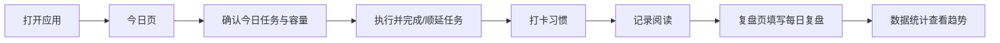
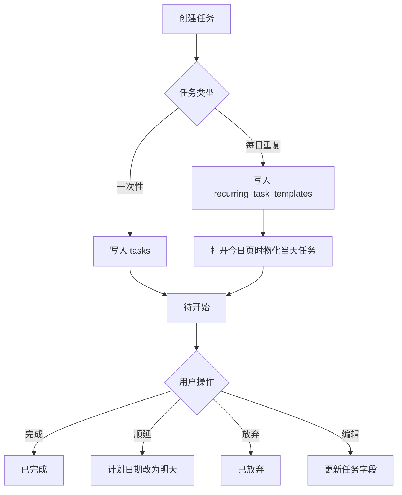
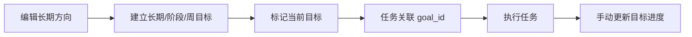
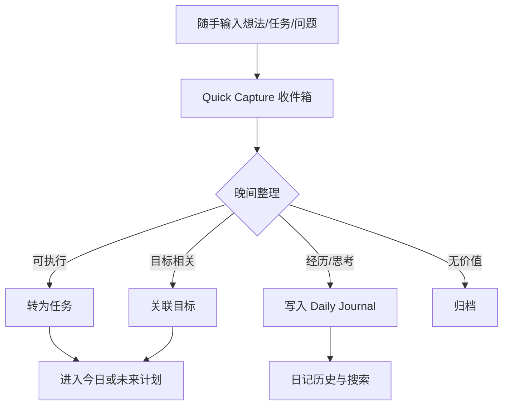

# 用户流程

本文区分两类流程：标记为“当前”的流程已经可以在应用中使用；标记为“目标”的流程仍是产品规划，不能当作现有功能。

## 1. 当前日常闭环

### 早晨

1. 打开“今日”，系统把启用的每日任务模板生成成当天任务。
2. 查看主任务、必做任务、时间容量和规划建议。
3. 必要时在今日页快速添加一个普通任务，或到“任务”页填写完整字段。

### 白天

1. 在今日页或任务页完成、顺延、放弃任务。
2. 在习惯页打卡；睡眠可以填写分钟数和备注。
3. 在阅读页选择书籍，登记阅读分钟、页数和收获。

### 晚上

1. 在“复盘”页记录事实、收获、问题和明日主任务。
2. 查看“数据统计”中的任务完成率、分类投入和学习连续天数。

## 2. 当前任务流程

“每天保持八小时睡眠”可以同时存在为：

- 每日任务：提醒当天要安排并确认这件事；
- 每日习惯：记录实际完成情况和连续性。

这是两个互补视角，不是重复数据错误。

## 3. 当前目标流程

目前目标变更会直接覆盖当前记录，没有版本历史、归档快照或变更说明。

## 4. 目标流程：快速捕获与日记

该流程目前尚未实现。现有“今日快速添加”只能直接创建任务，不能保存未分类内容；现有“复盘”也没有日记历史浏览和搜索。

## 5. 目标流程：目标历史

1. 创建或编辑目标时保留当前目标主记录。
2. 每次重要调整写入目标版本：调整前后内容、原因、时间。
3. 目标结束后归档，不影响历史任务关联。
4. 周/月复盘可查看目标进度快照。

该流程属于目标版本，不代表当前数据库已经支持。

## 6. 异常与恢复流程

- 表单校验失败：保留输入，展示可理解的错误，不写入数据库。
- 数据库写入失败：事务回滚，页面显示失败原因，不假装保存成功。
- 应用无法启动：先检查 Python、依赖和数据库路径，再查看终端报错。
- 数据库损坏或误操作：停止应用，备份现场，再按 [12_DATA_AND_BACKUP.md](12_DATA_AND_BACKUP.md) 恢复。

