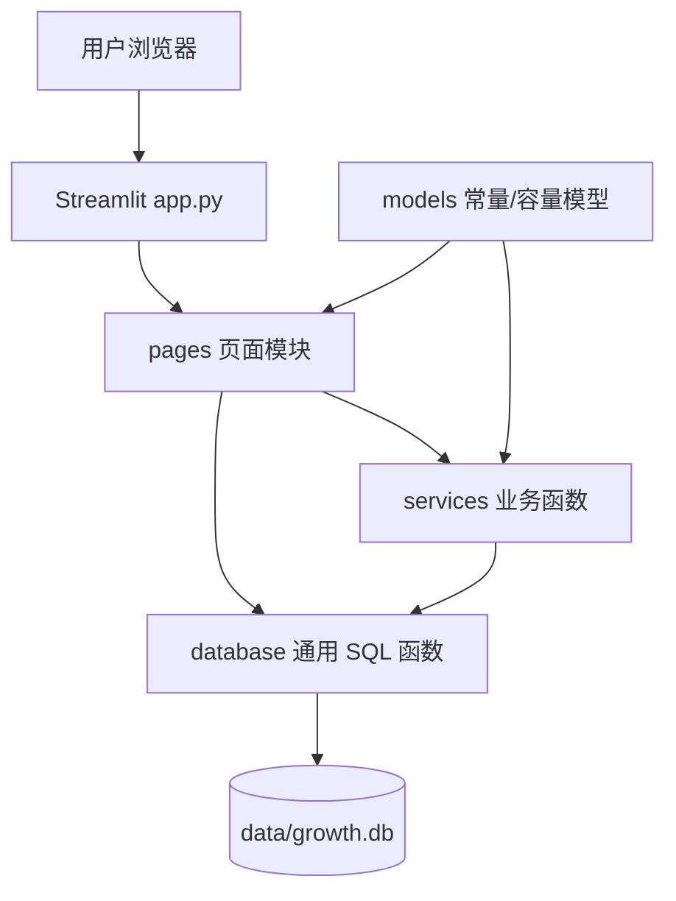
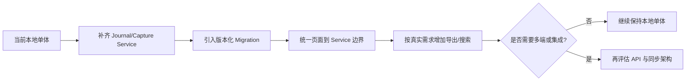

# 系统架构

## 1. 当前架构结论

Personal Growth OS 是一个本地单体 Streamlit 应用。浏览器只负责界面展示，Python 进程同时承担页面渲染、业务规则和 SQLite 数据访问。不包含独立前端、HTTP API、云端服务、消息队列或 AI Agent。



## 2. 目录职责

| 位置 | 当前职责 | 边界说明 |
|---|---|---|
| `app.py` | 初始化数据库、页面配置、导航与全局提醒 | 不应承载具体页面业务 |
| `pages/` | Streamlit 组件、输入与结果展示 | 部分页面仍直接写 SQL |
| `services/` | 任务、习惯、阅读、规划、统计、提醒规则 | 当前主要业务层 |
| `database.py` | Schema、连接、事务、默认数据、通用查询 | 同时承担了简单迁移与种子数据 |
| `models.py` | 分类、状态等常量和 `PlanCapacity` | 不是 ORM 模型 |
| `data/growth.db` | 用户的本地真实数据 | 应独立备份，不进入版本库 |
| `tests/` | 核心服务测试与页面烟雾测试 | 暂无浏览器端 E2E |
| `docs/` | 产品与工程基线 | 变更功能时同步维护 |

## 3. 当前核心调用链

以“完成任务”为例：

```text
用户点击完成
→ pages/today.py 或 pages/tasks.py
→ services/tasks.py::complete_task
→ database.py::get_connection
→ SQLite 更新 tasks
→ Streamlit 重新渲染
```

以“填写每日复盘”为例：

```text
用户提交表单
→ pages/review.py
→ database.py::execute（页面直接调用）
→ SQLite 写入 daily_reviews
→ 页面显示保存结果
```

第二条链路说明当前分层并不完全一致。后续扩展日记历史前，应先建立 review/journal service，让页面只负责交互。

## 4. 各业务模块

### Tasks

负责任务 CRUD、状态流转、延期和每日模板物化。每日模板与实例分表，可以保留历史并避免重复生成。

### Planner

根据设置中的可用分钟、当天任务和分类投入生成确定性建议。它是规则函数，不是 AI 自动规划器。

### Habits

负责习惯创建、当天日志 upsert 和连续天数计算。睡眠等习惯通过分钟数表达定量完成情况。

### Books

负责添加阅读日志并更新书籍进度。书籍列表和状态管理目前仍有页面直连 SQL。

### Stats

通过 SQLite 聚合任务数据，提供完成率、分类统计和学习连续天数。当前不是全域成长分析。

### Reminder

根据当前时间、设置和未完成任务生成页面内提醒。只有应用正在运行且页面刷新时才会出现，不是操作系统通知。

## 5. 数据与事务

- 每次 `get_connection` 打开一个 SQLite 连接并启用外键。
- 正常结束自动提交；SQLite 异常自动回滚。
- SQL 使用参数绑定，降低注入和转义问题。
- 当前 Schema 升级通过 `_ensure_schema_upgrades` 检查列并补齐，没有正式迁移版本表。

## 6. 当前架构债务

1. Goals、Review、Books 的部分写操作绕过 service，规则容易散落在 UI。
2. Schema、迁移、种子数据集中在一个文件，继续增长会难以维护。
3. 迁移没有版本号、执行记录和回滚说明。
4. 统计口径集中度不足，例如阅读的“今日分钟”语义不准确。
5. 默认人生方向和目标过于具体，首次启动体验没有充分体现用户所有权。

## 7. 推荐演进顺序



当前用户规模和部署形态不需要 Redis、消息队列、微服务或向量数据库。只有出现明确的多端同步、并发或检索需求时再引入。

## 8. 安全与隐私边界

- 数据默认只在本机 SQLite 中保存。
- 应用当前没有登录和权限系统，因此不要直接暴露到公网。
- 数据库可能包含日记、习惯和人生目标，备份文件也应视为敏感数据。
- 未来接入 AI 前，必须明确哪些字段可发送、征得用户许可，并允许关闭外发。

## 9. 小白解释

- `app.py` 像大楼入口：先检查数据库，再把你带到各个页面。
- `pages/` 像不同房间：决定页面上有什么按钮、输入框和结果。
- `services/` 像办事规则：例如“完成任务时要同时记录完成度和时间”。
- `database.py` 像页面与 SQLite 之间的翻译官：负责用安全、统一的方式读写数据。
- `models.py` 更像共享词典：集中保存状态、分类和容量结果；当前并不是一张数据库表对应一个类的 ORM。
- SQLite 像一本本地总账，`growth.db` 就是装下全部表的文件。
- Migration 像给住着人的旧房子加新房间：必须保留原来的家具和住户数据，不能推倒重建。
