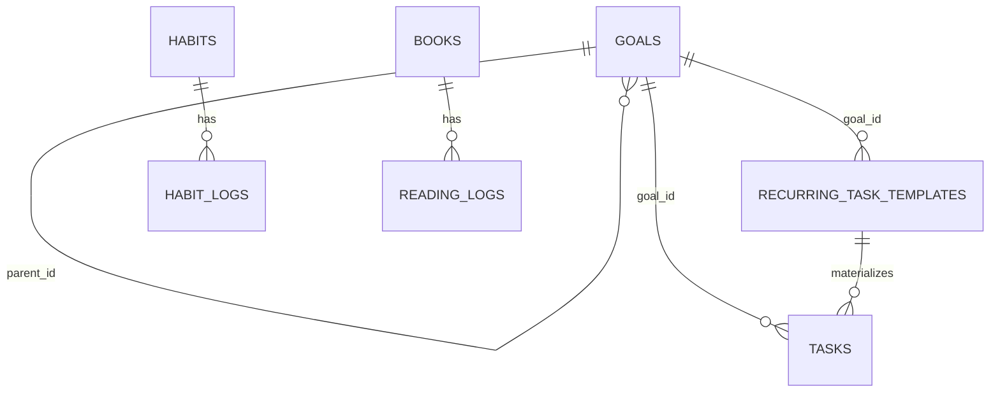

# 数据库设计

## 1. 当前数据库

- 引擎：SQLite
- 文件：`data/growth.db`
- 初始化入口：`database.py::init_database`
- 时间保存：ISO 文本；日期通常为 `YYYY-MM-DD`
- 外键：每个连接执行 `PRAGMA foreign_keys = ON`
- 当前 Schema 版本：v2

这是用户真实数据文件。开发和测试不得用生产数据做清空、重建或破坏性实验。

## 2. 当前关系图

`settings`、`directions`、`daily_reviews`、`schema_migrations` 当前是独立表。

## 3. 当前表与字段

### schema_migrations

| 字段 | 类型/约束 | 用途 |
|---|---|---|
| `version` | INTEGER PK | 迁移版本号 |
| `name` | TEXT NOT NULL | 迁移名称 |
| `checksum` | TEXT NOT NULL | 防止已经执行的迁移被静默改写 |
| `applied_at` | TEXT NOT NULL | 实际执行时间 |

### settings

| 字段 | 类型/约束 | 用途 |
|---|---|---|
| `key` | TEXT PK | 设置名称 |
| `value` | TEXT NOT NULL | 设置值，业务层负责解析 |

### directions

| 字段 | 类型/约束 | 用途 |
|---|---|---|
| `id` | INTEGER PK，只允许 1 | 单例方向记录 |
| `long_term_vision` | TEXT | 长期愿景 |
| `primary_conflict` | TEXT | 当前主要矛盾 |
| `secondary_conflicts` | TEXT | 次要矛盾 |
| `current_priority` | TEXT | 当前优先事项 |
| `not_doing` | TEXT | 明确不做的事 |
| `updated_at` | TEXT | 最近更新时间 |

### goals

| 字段 | 类型/约束 | 用途 |
|---|---|---|
| `id` | INTEGER PK | 目标 ID |
| `parent_id` | FK goals，可空 | 父目标，删除父级后置空 |
| `level` | long_term/stage/weekly | 目标层级 |
| `name` | TEXT | 名称 |
| `why` | TEXT | 原因 |
| `start_date` / `target_date` | TEXT，可空 | 起止日期 |
| `progress` | 0–100 | 手动进度 |
| `success_criteria` | TEXT | 成功标准 |
| `status` | TEXT | 业务状态 |
| `is_current` | 0/1 | 是否当前重点 |
| `created_at` | TEXT | 创建时间 |

### tasks

| 字段组 | 字段 | 说明 |
|---|---|---|
| 身份 | `id`, `title`, `description` | 主键与任务描述 |
| 分类 | `category`, `priority` | 类型和优先级 |
| 计划 | `planned_date`, `start_time`, `end_time`, `time_slot` | 日期与时段 |
| 工时 | `estimated_minutes`, `actual_minutes`, `counts_toward_capacity` | 预计、实际和容量口径 |
| 验收 | `acceptance_criteria`, `notes` | 完成标准和备注 |
| 状态 | `status`, `completion_percentage`, `completed_at` | 执行结果 |
| 来源 | `source` | `system` 或 `user` |
| 关联 | `goal_id`, `recurring_template_id` | 目标与每日模板 |
| 控制 | `must_today`, `postponement_count` | 必做和顺延次数 |
| 审计 | `created_at` | 创建时间 |

索引：`planned_date`、`status`、`category`。另有 `(recurring_template_id, planned_date)` 的非空唯一索引，保证同一每日模板一天只生成一次。

### recurring_task_templates

字段：`id`、唯一 `title`、`description`、`category`、`priority`、`start_time`、`end_time`、`time_slot`、`estimated_minutes`、`acceptance_criteria`、`notes`、`goal_id`、`must_today`、`counts_toward_capacity`、`active`、`created_at`。

它保存每日任务规则，不保存某天的完成结果；具体结果由生成后的 `tasks` 记录承担。

### habits / habit_logs

`habits`：`id`、唯一 `name`、`category`、`target_minutes`、`active`、`created_at`。

`habit_logs`：`id`、`habit_id`、`log_date`、`completed`、`minutes`、`notes`；`(habit_id, log_date)` 唯一，习惯删除时日志级联删除。

### books / reading_logs

`books`：`id`、唯一 `title`、`list_type`、`stage`、`category`、`sequence`、`purpose`、`estimated_weeks`、`total_pages`、`current_page`、`start_date`、`target_date`、`status`、`today_minutes`、`total_minutes`、`notes`、`is_light_reading`。

`reading_logs`：`id`、`book_id`、`log_date`、`minutes`、`pages_read`、`learned`、`changed_view`、`real_world_link`、`application`、`created_at`；书籍删除时日志级联删除。

注意：当前 `books.today_minutes` 会随阅读记录持续相加，字段名与实际累计语义不一致。修复前，报表应优先按 `reading_logs.log_date` 聚合当天分钟。

### daily_reviews

字段：`id`、唯一 `review_date`、`events`、`main_task_done`、`biggest_gain`、`learning_improvement`、`life_improvement`、`work_problem`、`life_state`、`growth_thought`、`time_waste`、`tomorrow_main_task`、`reduce_items`、`keep_items`、`problem_to_solve`、`free_text`、`updated_at`。

它是一日一条的结构化复盘，不等于完整 Daily Journal。

## 4. 删除与一致性规则

- 删除目标：关联任务和每日模板保留，`goal_id` 置空。
- 停用每日模板：过去已生成任务保留；未来不再生成。
- 删除习惯或书籍：对应日志会级联删除，属于高影响操作，UI 必须二次确认并提示不可逆范围。
- 每日复盘按日期唯一，重复保存应更新同一天记录。

## 5. 当前迁移机制

`init_database` 先判断是新数据库还是已有数据库。已有数据库如存在待执行迁移，会先运行完整性与外键检查，再通过 SQLite Backup API 创建迁移前备份，之后按版本顺序执行迁移并写入 `schema_migrations`。重复启动不会重复执行或重复备份。

当前 v1 记录现有基线，v2 兼容补齐 `tasks.recurring_template_id`、`tasks.counts_toward_capacity` 和每日任务唯一索引。若数据库版本高于程序支持版本，或迁移校验值不匹配，程序会停止启动，不冒险写入。

## 6. 推荐未来表（尚未实现）

| 表 | 目的 | 最小关键字段 |
|---|---|---|
| `journal_entries` | Daily Journal 历史 | id, entry_date, content, tags, created_at, updated_at |
| `quick_captures` | 未分类收件箱 | id, content, created_at, category, status, converted_type, converted_id, processed_at |
| `goal_versions` | 目标变更历史 | id, goal_id, version_no, snapshot_json, change_reason, created_at |
| `goal_progress_snapshots` | 周/月进度快照 | id, goal_id, snapshot_date, progress, note |

新增表时不得把现有 `daily_reviews` 强行改名覆盖；应设计兼容迁移和数据映射。

Quick Capture 的默认值建议为 `category='未分类'`、`status='Inbox'`。`converted_type` 与 `converted_id` 记录它最终变成了什么；转换过程必须在一个事务中完成。

## 7. 小白解释

- 主键是每条记录独一无二的编号，像身份证号。
- 外键是记录之间的连接线，例如任务通过 `goal_id` 指向目标。
- Snapshot 就像给某一天的目标拍照；以后目标变了，旧照片仍然保留。
- Schema Migration 像给旧房子加房间：要保住原有家具，也就是用户已经积累的数据。
